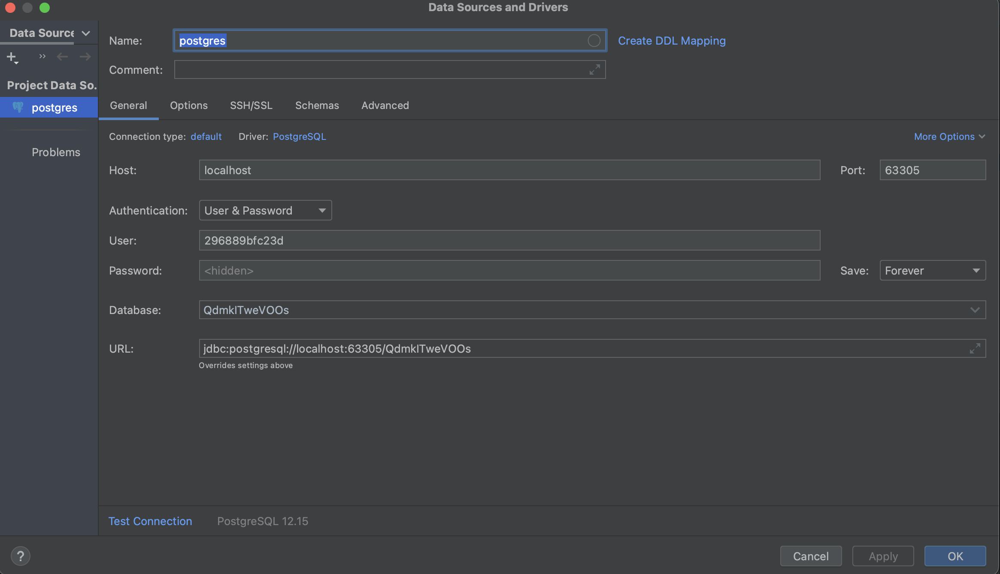

# Spring Boot REST API Mutlitenancy App

### Tutorials used for creating an application in the Cloud Foundry Environment:
* [Create an Application with SAP Java Buildpack](https://developers.sap.com/tutorials/btp-cf-buildpacks-java-create.html)
* [Using Postman for API Testing with XSUAA](https://blogs.sap.com/2020/03/02/using-postman-for-api-testing-with-xsuaa/)

### Tutorials used for adding Multitenancy support

* [Developing Multitenant Applications in the Cloud Foundry Environment](https://help.sap.com/docs/btp/sap-business-technology-platform/developing-multitenant-applications-in-cloud-foundry-environment?locale=en-US&q=multi%20tenancy)
* [Deep Dive 6 with SAP Cloud SDK: Extend your Cloud Foundry Application with Tenant-Aware Persistency](https://blogs.sap.com/2017/12/20/deep-dive-6-with-sap-s4hana-cloud-sdk-extend-your-cloud-foundry-application-with-tenant-aware-persistency/)
* [How to build a multi-tenant SaaS solution: A Spring Boot sample app](https://jomatt.io/how-to-build-a-multi-tenant-saas-solution-sample-app/)

### Other useful links
* [Remote Debugging on Cloud Foundry](https://blogs.sap.com/2019/07/24/remote-debugging-on-cloud-foundry/)

### How to connect to database running on cloudfoundry locally through ssh
1. **Activate SSH for your app:**
```
   cf enable-ssh YOUR-HOST-APP
```
2. **Create a service key for your service instance using the cf create-service-key command:**
```
cf create-service-key MY-DB EXTERNAL-ACCESS-KEY
```
3. **Retrieve your new service key using the cf service-key command:**
```
cf service-key MY-DB EXTERNAL-ACCESS-KEY
```
4. **Configure your SSH tunnel:**
```
cf ssh -L 63305:postgres-e41ca1a6-9d2e-4eba-9e7d-a07c124e0174.cqryblsdrbcs.us-east-1.rds.amazonaws.com:2391 YOUR-HOST-APP

```
* You can use any available local port for port forwarding; for example, `63306`.
* `cqryblsdrbcs.us-east-1.rds.amazonaws.com` is the address provided under hostname in the service key retrieved earlier.
* `3306` is the port provided under `port`.
* `YOUR-HOST-APP` is the name of your host app.

5. **Access your service instance from Intelij Idea**

